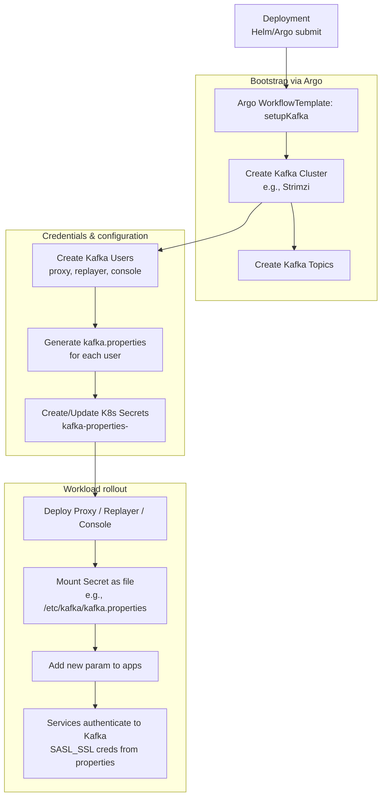

# Scratch pad

```bash

```

#### Extract a cluster sert from `abc-cluster-ca-cert` on kubernetes
```bash
kubectl -n ma get secret abc-cluster-ca-cert \
  -o jsonpath='{.data.ca\.crt}' | base64 -d > cluster-ca.crt
```

#### Create a jsk store for the cluster cert
```bash
keytool -import -file cluster-ca.crt -alias cluster-ca \
  -keystore client.truststore.jks \
  -storepass changeit -noprompt
```

#### Start the capture proxy with a sample kafka config
```bash
./gradlew TrafficCapture:trafficCaptureProxyServer:run --args="--kafkaConfigFile /home/ubuntu/git/opensearch-migrations/producer.props --kafkaConnection localhost:9092 --listenPort 9054 --destinationUri http://localhost:9200"
```


