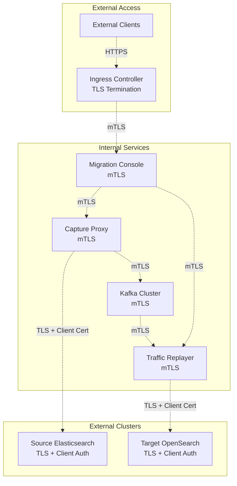

# OpenSearch Migrations Kubernetes Architecture

This document provides a comprehensive overview of the OpenSearch Migrations system architecture deployed on Kubernetes, including components, network configuration, security posture, and application workflow.

## System Overview

The OpenSearch Migrations K8s deployment provides a comprehensive solution for migrating from Elasticsearch clusters to OpenSearch clusters. There are two main deployment approaches:

1. **Basic Migration Assistant** (`migrationAssistant`) - Core migration services
2. **Advanced Migration Assistant** (`migrationAssistantWithArgo`) - Full-featured with Argo workflows and enhanced observability

## High-Level Architecture


## Network Configuration


## Security Posture


## Application Workflow


## Key Components Details

### Core Services

- **Migration Console**: Web-based UI for orchestrating migrations, monitoring progress, and managing configurations
- **Capture Proxy**: Transparent proxy that intercepts client traffic to the source cluster and captures it to Kafka
- **Traffic Replayer**: Reads captured traffic from Kafka and replays it against the target cluster with configurable speed
- **Bulk Document Loader (RFS)**: Handles snapshot-based data migration for historical data
- **Kafka Cluster**: Message broker for storing and managing captured traffic

### Infrastructure Services

- **Shared Storage**: Persistent volumes for logs and snapshots
- **Observability**: Optional Prometheus, Grafana, and Jaeger for monitoring and tracing
- **Service Mesh Ready**: Architecture supports Istio/other service mesh implementations

### Advanced Features (Argo variant)

- **Argo Workflows**: Orchestrates complex migration workflows
- **OpenTelemetry**: Advanced observability and tracing
- **FluentBit**: Log aggregation and forwarding
- **LocalStack**: AWS service emulation for testing

## Current Security Implementation

### Authentication & Authorization
- Service accounts with RBAC permissions for each component
- Role-based access control for Kubernetes resources
- Basic authentication for cluster access (configurable)

### Configuration Management
- ConfigMaps for non-sensitive configuration
- Kubernetes Secrets for passwords and certificates
- Shared configuration system for cross-component settings

### Network Security
- Service-to-service communication within cluster
- Ingress controllers for external access control
- Ready for service mesh implementation

## TLS Implementation Roadmap

### Current TLS Status
Based on the current configuration files, TLS implementation is partially prepared but not fully enabled:

1. **Commented TLS Configuration**: SSL config files are referenced but commented out in capture proxy values
2. **Basic Auth Over HTTP**: Currently using basic authentication without TLS
3. **Insecure Connections**: Many components configured with `insecure: true` flags

### TLS Implementation Strategy

#### Phase 1: Certificate Management Infrastructure


**Implementation Steps:**

1. **Deploy cert-manager** (already available in Argo variant):
   ```yaml
   cert-manager:
     version: 1.17.2
     repository: https://charts.jetstack.io
     values:
       crds:
         enabled: true
   ```

2. **Create ClusterIssuer for internal certificates**:
   ```yaml
   apiVersion: cert-manager.io/v1
   kind: ClusterIssuer
   metadata:
     name: migration-ca-issuer
   spec:
     ca:
       secretName: migration-ca-key-pair
   ```

3. **Generate root CA certificate for internal communication**

#### Phase 2: Inter-Service TLS


**Required Changes:**

1. **Capture Proxy TLS Configuration**:
   - Enable SSL config file: `/usr/share/elasticsearch/config/proxy_tls.yml`
   - Update service to use HTTPS port 9200
   - Configure client certificate verification

2. **Kafka TLS Configuration**:
   - Enable SSL listeners on port 9093
   - Configure mutual TLS authentication
   - Update all Kafka clients to use SSL

3. **Traffic Replayer TLS**:
   - Configure TLS client certificates for target cluster connections
   - Update authentication headers for HTTPS

4. **Migration Console TLS**:
   - Enable HTTPS on port 8443
   - Configure TLS for web UI access
   - Update ingress controllers for TLS termination

#### Phase 3: External Cluster TLS

**Configuration Updates Needed:**

1. **Update shared configurations to use HTTPS endpoints**:
   ```yaml
   shared-configs:
     globalParameters:
       sourceCluster:
         object:
           endpoint: "https://elasticsearch-master:9200"
           allowInsecure: false  # Change from true
           certFile: "/certs/source-ca.crt"
       targetCluster:
         object:
           endpoint: "https://opensearch-cluster-master:9200" 
           allowInsecure: false  # Change from true
           certFile: "/certs/target-ca.crt"
   ```

2. **Certificate mounting in deployment configurations**

#### Phase 4: Complete TLS Security Model



### Implementation Checklist

- [ ] **Phase 1: Certificate Infrastructure**
  - [ ] Deploy cert-manager
  - [ ] Create internal CA
  - [ ] Configure ClusterIssuer
  - [ ] Generate service certificates

- [ ] **Phase 2: Service-to-Service TLS**
  - [ ] Enable Kafka SSL/TLS
  - [ ] Configure Capture Proxy HTTPS
  - [ ] Update Traffic Replayer for TLS
  - [ ] Enable Migration Console HTTPS

- [ ] **Phase 3: External Cluster TLS**
  - [ ] Configure source cluster certificates
  - [ ] Configure target cluster certificates
  - [ ] Update connection configurations
  - [ ] Test certificate validation

- [ ] **Phase 4: Security Hardening**
  - [ ] Enable mutual TLS (mTLS) between services
  - [ ] Configure certificate rotation
  - [ ] Implement certificate monitoring
  - [ ] Update security policies

### Configuration Files to Modify

1. **Capture Proxy**: `charts/components/captureProxy/values.yaml`
   - Uncomment and configure `sslConfigFile`
   - Update service definitions for HTTPS

2. **Kafka Cluster**: `charts/sharedResources/baseKafkaCluster/values.yaml`
   - Add SSL listener configuration
   - Configure authentication mechanisms

3. **Traffic Replayer**: `charts/components/replayer/values.yaml`  
   - Add TLS client configuration
   - Update target cluster connection settings

4. **Migration Console**: `charts/components/migrationConsole/values.yaml`
   - Configure HTTPS listener
   - Update ingress for TLS termination

5. **Shared Configurations**: `charts/aggregates/migrationAssistant/values.yaml`
   - Update cluster endpoints to HTTPS
   - Set `allowInsecure: false`
   - Add certificate file paths

This roadmap provides a structured approach to implementing comprehensive TLS security across the OpenSearch Migrations infrastructure while maintaining operational functionality throughout the transition.
