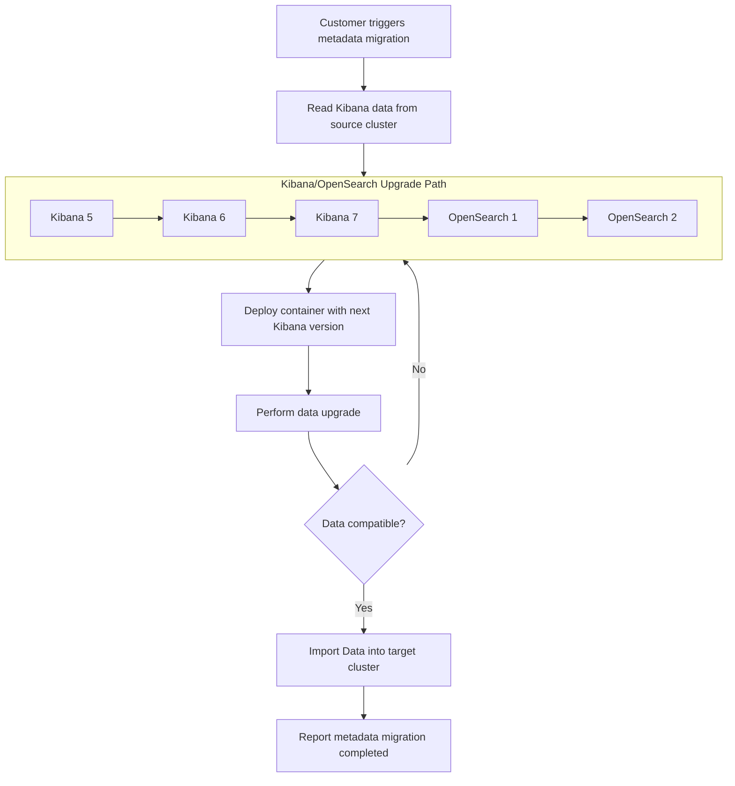

#### Problem Statement
Customers migrating from Kibana to OpenSearch Dashboards encounter significant operational challenges due to the lack of automated dashboard migration, resulting in manual, error-prone processes that risk data loss and service disruptions.

#### Requirements
The solution must migrate Kibana dashboards and associated objects into OpenSearch Dashboards, ensuring compatibility across a range of Elasticsearch versions. It should integrate with the existing Migration Assistant to maintain operational continuity.

#### Solution Approach
The proposed approach extends the existing Migration Assistant by developing a new tool that reads Kibana objects pumps them through the upgrade workflow for each version between the source and target until they can be installed into the target OpenSearch Dashboard instance. By automating this upgrade process it reducing manual intervention and takes minimal effort to implement.

