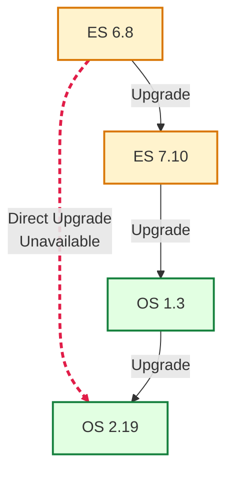
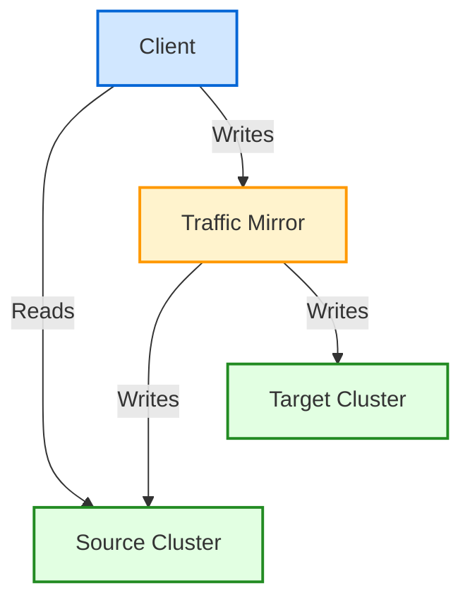
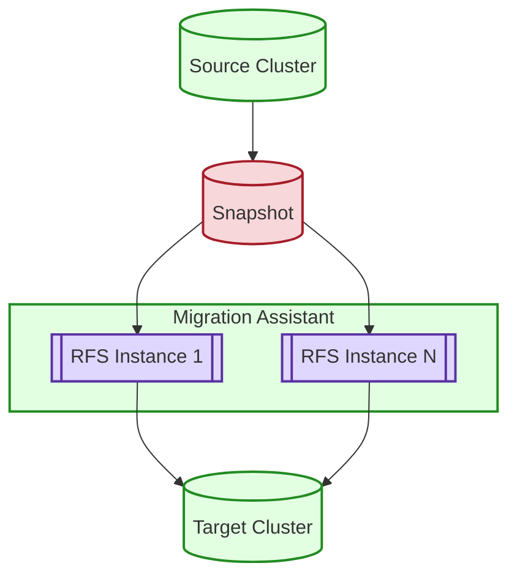
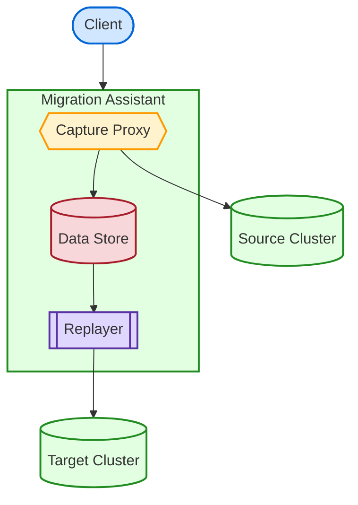
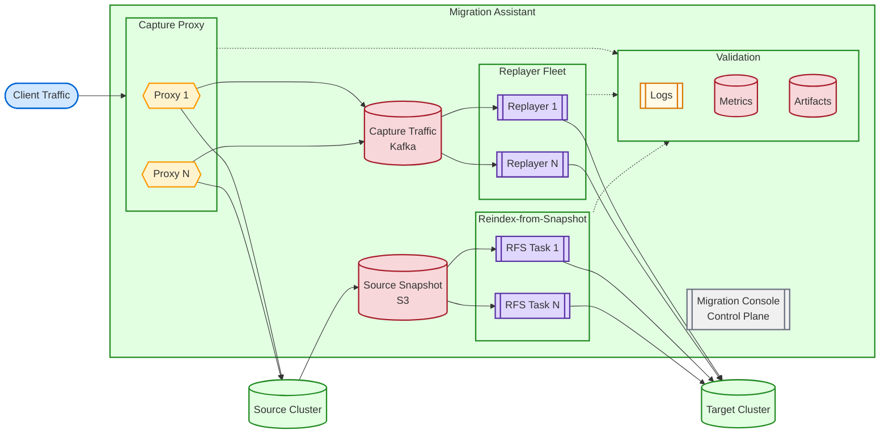

# OpenSearch Con North America 2025 Assets

## Multi-hop upgrade

```mermaid
flowchart TD
    ES68[ES 6.8]:::es
    ES710[ES 7.10]:::es
    OS13[OS 1.3]:::os
    OS219[OS 2.19]:::os

    ES68 -.->|Direct Upgrade<br>Unavailable| OS219
    linkStyle 0 stroke:#e11d48,stroke-width:3px,stroke-dasharray:6 4;

    ES68 -->|Upgrade| ES710
    ES710 -->|Upgrade| OS13
    OS13 -->|Upgrade| OS219

    classDef es fill:#fff3cd,stroke:#d97706,stroke-width:2px;
    classDef os fill:#e2ffe2,stroke:#15803d,stroke-width:2px;
```

## Dual Write upgrade

```mermaid
flowchart TD
    C[Client]:::client -->|Writes| M[Traffic Mirror]:::mirror
    C -->|Reads| SC[Source Cluster]:::cluster
    M -->|Writes| SC
    M -->|Writes| TC[Target Cluster]:::cluster

    TC --- SC
    linkStyle 4 stroke-width:0px,fill:none

    classDef client fill:#d1e7ff,stroke:#0366d6,stroke-width:2px;
    classDef mirror fill:#fff3cd,stroke:#ff9900,stroke-width:2px;
    classDef cluster fill:#e2ffe2,stroke:#228b22,stroke-width:2px;
```

## RFS 

```mermaid
flowchart TD
    SC[(Source Cluster)]:::cluster --> S
    S[(Snapshot)]:::datastore
    S --> RFS1[[RFS Instance 1]]:::container
    S --> RFSN[[RFS Instance N]]:::container


    subgraph MA[Migration Assistant]
        RFS1
        RFSN
    end

    RFS1 --> TC[(Target Cluster)]:::cluster
    RFSN --> TC

    classDef datastore fill:#f8d7da,stroke:#a71d2a,stroke-width:2px;
    classDef container fill:#e0d7ff,stroke:#5a32a3,stroke-width:2px;
    classDef cluster fill:#e2ffe2,stroke:#228b22,stroke-width:2px;
```

## Capture and Replay

```mermaid
flowchart TD
    C([Client]):::client --> MA

    subgraph MA[Migration Assistant]
        P{{Capture Proxy}}:::proxy --> DS[(Data Store)]:::datastore
        DS --> R[[Replayer]]:::replayer
    end

    P --> SC[(Source Cluster)]:::cluster
    R --> TC[(Target Cluster)]:::cluster

    classDef client fill:#d1e7ff,stroke:#0366d6,stroke-width:2px;
    classDef proxy fill:#fff3cd,stroke:#ff9900,stroke-width:2px;
    classDef cluster fill:#e2ffe2,stroke:#228b22,stroke-width:2px;
    classDef datastore fill:#f8d7da,stroke:#a71d2a,stroke-width:2px;
    classDef replayer fill:#e0d7ff,stroke:#5a32a3,stroke-width:2px;
```

## System Architecture

```mermaid
flowchart LR
    C([Client Traffic]):::client
    SRC[(Source Cluster)]:::cluster
    TGT[(Target Cluster)]:::cluster

    subgraph MA[Migration Assistant]
        subgraph PROXY[Capture Proxy]
            P1{{Proxy 1}}:::proxy
            PN{{Proxy N}}:::proxy
        end

        DS[(Capture Traffic<br/>Kafka)]:::datastore

        subgraph RFS[Reindex-from-Snapshot]
            RFS1[[RFS Task 1]]:::replayer
            RFSN[[RFS Task N]]:::replayer
        end

        MC[[Migration Console<br>Control Plane]]:::console

        subgraph REPL[Replayer Fleet]
            RP1[[Replayer 1]]:::replayer
            RPN[[Replayer N]]:::replayer
        end

        SNAP[(Source Snapshot<br/>S3)]:::datastore

        subgraph VAL[Validation]
          CW1[[Logs]]:::tool
          CW2[(Metrics)]:::datastore
          EFS[(Artifacts)]:::datastore
        end
    end

    C --> PROXY

    %% Live capture path
    P1 --> SRC
    PN --> SRC

    P1 --> DS
    PN --> DS

    %% Replay path from captured data
    DS --> RP1
    DS --> RPN
    RP1 --> TGT
    RPN --> TGT

    %% RFS path from snapshot
    SRC --> SNAP
    SNAP --> RFS1
    SNAP --> RFSN
    RFS1 --> TGT
    RFSN --> TGT

    %% Validation taps
    PROXY .-> VAL
    REPL .-> VAL
    RFS .-> VAL

    classDef client fill:#d1e7ff,stroke:#0366d6,stroke-width:2px;
    classDef proxy fill:#fff3cd,stroke:#ff9900,stroke-width:2px;
    classDef cluster fill:#e2ffe2,stroke:#228b22,stroke-width:2px;
    classDef datastore fill:#f8d7da,stroke:#a71d2a,stroke-width:2px;
    classDef replayer fill:#e0d7ff,stroke:#5a32a3,stroke-width:2px;
    classDef console fill:#f0f0f0,stroke:#6b7280,stroke-width:2px;
    classDef queue fill:#ffe6f2,stroke:#c2185b,stroke-width:2px;
    classDef lb fill:#e6f7ff,stroke:#0ea5e9,stroke-width:2px;
    classDef tool fill:#fffbe6,stroke:#d97706,stroke-width:2px;
```