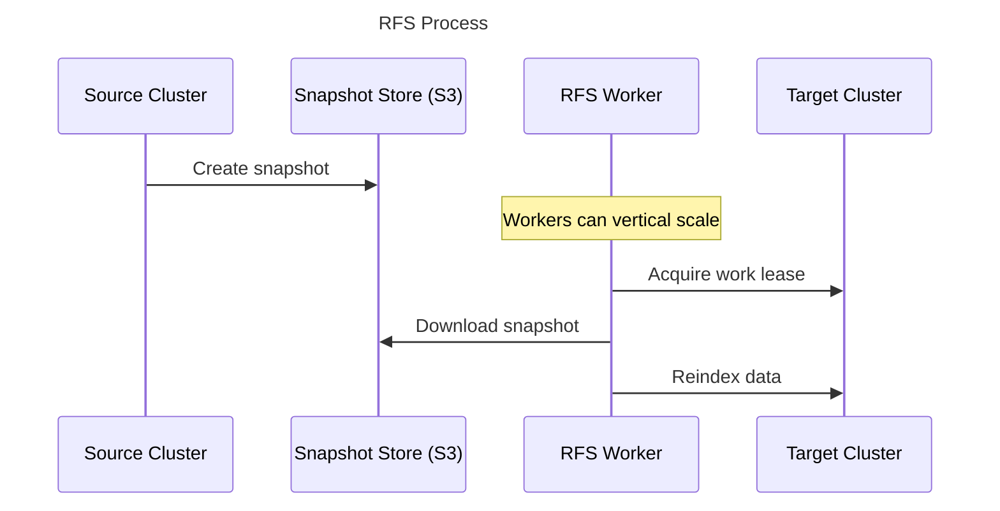
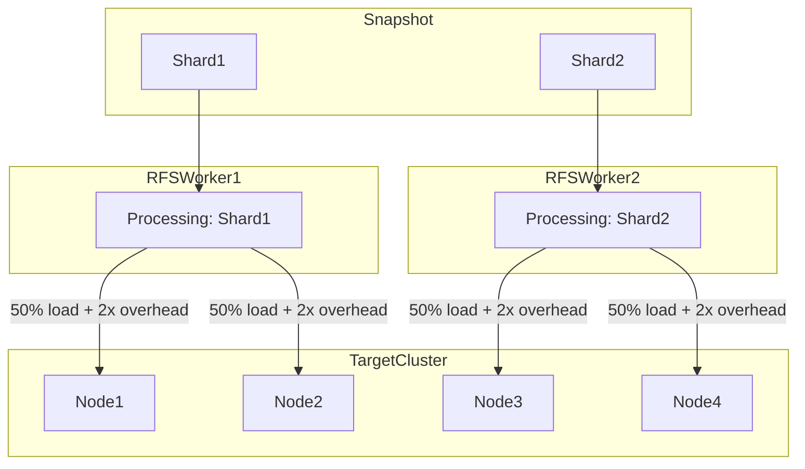
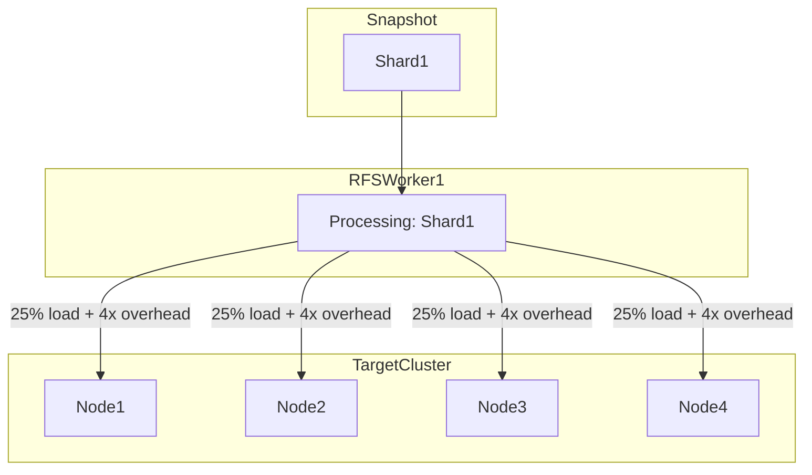
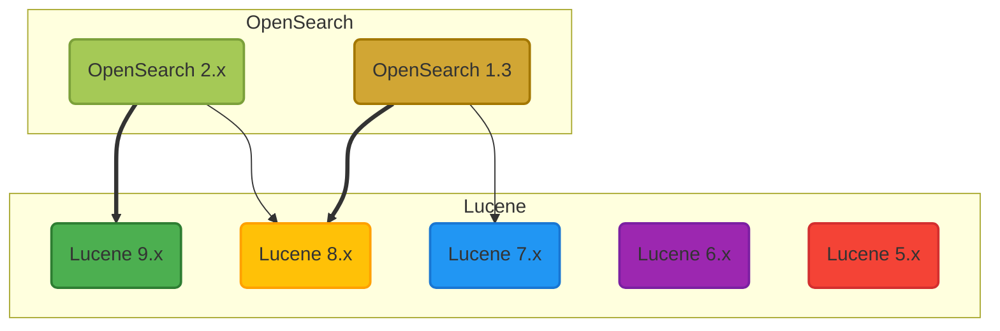
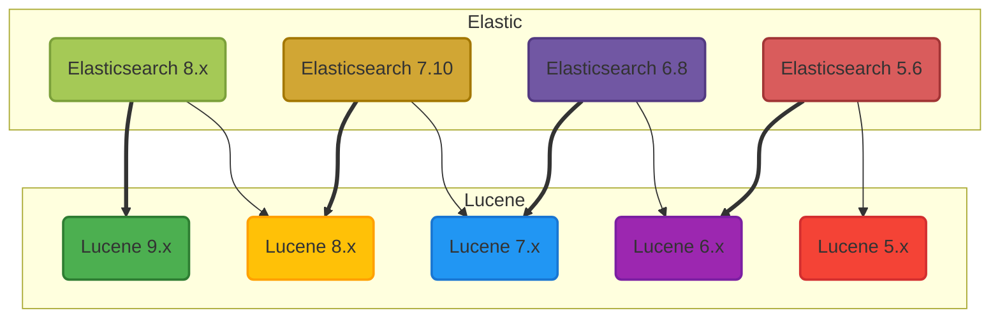
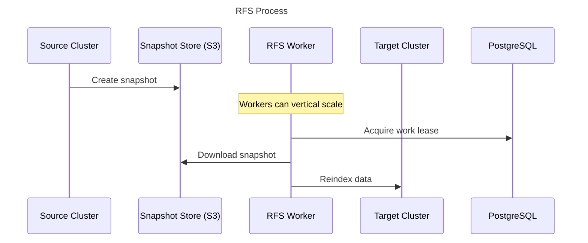
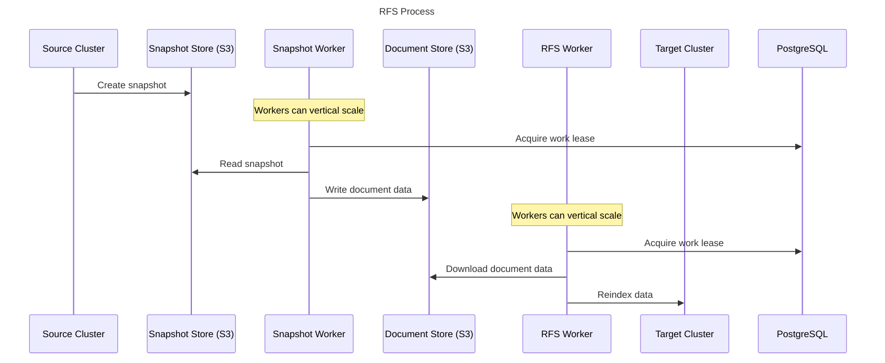
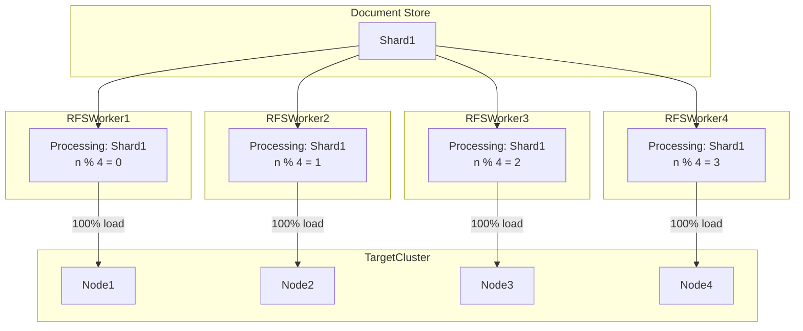

# Expanding Reindexing

Reindexing from Snapshot (RFS) was built for the Migration Assistant and has been adoption because it is low risk to the source cluster.  Snapshots house the data that is an Elasticsearch / OpenSearch cluster in a place that is outside of the cluster.  In the case of the Amazon Managed OpenSearch these snapshots are stored in S3, an ideal place to read from - decoupling the source cluster bottle-necking the target cluster.  Full background for the see the current [RFS Design](../RFS/docs/DESIGN.md).



- [Expanding Reindexing](#expanding-reindexing)
  - [Limitations](#limitations)
    - [Worker Coordination](#worker-coordination)
    - [Upfront download and working space](#upfront-download-and-working-space)
    - [Horizontal scale limits](#horizontal-scale-limits)
    - [Lucene Support over time](#lucene-support-over-time)
  - [Proposals (High Level)](#proposals-high-level)
    - [Deploy PostgreSQL database for work coordination](#deploy-postgresql-database-for-work-coordination)
    - [Decouple Reindexing from the Snapshot](#decouple-reindexing-from-the-snapshot)

## Limitations

RFS has limits on governed by its current structure:
- Work leases are managed on target cluster
- Large upfront download and working space volume
- Common issue oversized shard also limits RFS horizontal scaling
- Loading older lucene formats


### Worker Coordination

RFS is meant to run in a distributed way with many workers coming up at once and no external data stores.  Using the target cluster for state management was the cleanest approach available using a worker lease based  system.

Unfortunately, OpenSearch does **not** support strict definitions of Atomicity, Consistency, Isolation, or Durability - the standards of [ACID Compliant databases](https://www.mongodb.com/resources/products/capabilities/acid-compliance).  While there is an implementation of a worker lease management system, its complex and as we expand supported target versions it might break in unexpected ways.

Additional since the target cluster is where the documents are being reindexed keeping the worker lease traffic low is a requirement because with too many RFS workers writing to the store at once could cause contention and failures processing traffic.

### Upfront download and working space

The snapshot is not directly usable from S3, it needs to be pre-processed by downloading and read into Lucene (the underlying technology use for document storage / indexing).  This process requires non-sequential reads that make streaming from s3 complex, requiring a caching layer that might effectively need to cache the whole shard.

The size of the working space is governed by the shard size, with customers having shards that are more than 500GB in size, this requires that working space to be sized at least as big as the cluster.

Together this means that after RFS has started there could be considerable time before data is reindex, and if there are issues that cause a RFS worker to be restarted considerable download and processing time could be repeated.

```mermaid
gantt
    title RFS Worker Process Timeline
    dateFormat  HH:mm
    axisFormat  %H:%M
    section Tasks
    Download Snapshot  :active, d1, 00:00   , 24m
    Unpack Snapshot    :active, d2, after d1, 6m
    Reindex to Target  :active, d3, after d2, 30m
```



### Horizontal scale limits

Over the lifetime of an OpenSearch cluster customers tend to discover that the sharding strategy choice made when an index is first created needs to be tweaked.  A common example is that index has 2 shards, in a cluster with 4 data nodes, only a half of the nodes can handle index or query requests - a large amount of unused compute.

During a migration the target cluster could set the sharding size to 4 and use all nodes in the cluster.  However, RFS only can divide its workload by shards which are the units that are downloaded and unpacked, maxing out the number of concurrent workers at 2.

**Reshard with 1 to 2 Expansion**


Work in flight for subshard processing allows dividing shard data into chunks by it's sequence number.  These chunks would contain documents `chunk1:[1..n]` and  `chunk2:[n+1..]`. The striping process is the hashcode of the document id, so the hash space of chunk1 and chunk2 are effectively the same.

In practice this means if you had a single shard that is to be migrated into 4 shards on the target, only use a single RFS worker with its' load is spread equally. Since the work is fanning out farther, its causing even more overhead on the cluster.

While using subshard to chunk into 4 pieces could scale up the number of RFS workers, but paying the additional overhead tax.    

**Reshard with 1 to 4 Expansion**


### Lucene Support over time

OpenSearch is a distributed system wrapper over Lucene a text search and indexing system.  Those snapshots are like-wise a thin wrapper of the serialized lucene indexes and document data.

Those unpacking processes are done so that RFS can use lucene to directly read the snapshot data to extract the documents in that data to be collected and reindexed against the target cluster.

Lucene has a backwards compatibility story where it supports reading a subset of the previous versions of lucene via [backwards-codecs](https://stackoverflow.com/a/53390082/533057).  We are currently using lucene v9 and have success reading lucene data created in Elasticsearch 6.8 using lucene v7.  However, for customers that upgraded from Elasticsearch 5.6 -> Elasticsearch 6.8 they might have lucene data that was created in lucene v6 - which we cannot read.

**OpenSearch Lucene Mapping**


**Elasticsearch Lucene Mapping**


## Proposals (High Level)

### Deploy PostgreSQL database for work coordination

The original requirement for no external data store is no longer required, and if we revist that we open a host of improvement that become trivial after switching to a PostgreSQL implementation.

- Real-time progress updates could be logged due to decoupling the target cluster under load from the data store.
- Remove Painless code that is nigh unmaintainable from the codebase, see [OpenSearchWorkCoordinator.java](https://github.com/opensearch-project/opensearch-migrations/blob/main/RFS/src/main/java/org/opensearch/migrations/bulkload/workcoordination/OpenSearchWorkCoordinator.java).
- Record throttling events or other distributed state that could be actioned by other workers.



### Decouple Reindexing from the Snapshot

As outline above the RFS worker has many different responsibilities that can impact the ability to scale horizontally.  By pulling the responsibility of understanding the structure of the snapshot files we can drastically reshape how RFS scales.



**Document Standard**

One of the reasons that we can decouple snapshot processing from RFS is there is only a small amount of information that is relevant to the reindexing process: the index id, shard id, document id, and document source.  This would allow us to adopt a simplified document standard.  Future win: this would allow migration of non-lucene data into OpenSearch via RFS.

```java
interface ReindexDocument {
    String indexName;
    String shardId;
    String documentId;
    JSONObject body;
}
```

**Storage Format**

It is not clear what the best format is for throughput and experimentation could prove this out; to start with it could be putting each document in its own s3 path `s3://bucket-name/{index-name}/{shard-id}/{document-id}.json` or using a fixed size chunked 100mb that is compressible.  This would make the runtime of the RFS workers much more deterministic.

**Reindexer document reader flexibility**

With the overhead of reading snapshot data there is an opportunity to change the algorithm we use to select the documents to reindex on.  Assuming that reading documents will always be faster than sending them for reindex, we could have the reindexer choose an algorithm that best suites the target cluster.

On a 'scale up' operation, if documents from a shard were to be reshard into two different shards on the new cluster, the cluster had to be responsible for diving up those items.  If instead the reindexer picked documents based on the new sharding algorithm we could ensure documents would only go from a single RFS worker onto a single destination node.


**Reshard with 1 to 4 Expansion minimal overhead**



